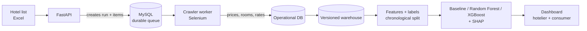

# Hotel Rate Intelligence & Forecasting Platform

    

Master's thesis, MSE at FSB. *A Web-Based System for Continuous Hotel Room Rate Monitoring and Short-Term Forecasting in Vietnam Using Machine Learning.*

Independent hotels in Vietnam still check competitor prices by hand and price by gut feeling. This platform collects Booking.com listing prices every day for a fixed cohort of ~354 hotels in five cities (Ho Chi Minh City, Hanoi, Vung Tau, Da Lat, Phu Quoc), forecasts price movement 1, 3, 7 and 14 days ahead, and serves it through two views:

- **Hotelier view:** competitive-set price tracking, market forecast and pricing-position alerts.
- **Consumer view:** price history, short-term forecast and a "book now or wait" signal.

> **Status:** data collection is running through the official window (01/09 – 30/11/2026); the warehouse and exploratory analysis are built; model training and the dashboard are in progress. Only public listing prices are collected, for academic use, and collected data is not committed to this repository.

## At a glance

| | |
|---|---|
| Hotels / cities | ~354 / 5 |
| Check-in dates sampled per hotel per day | up to 12 (9 near, 3 far) |
| Price observations in first warehouse snapshot | 1.38 M |
| Forecast horizons | 1, 3, 7, 14 days |
| Target accuracy | >= 80 % of forecasts within ±20 % of the true price |

## System overview



## Engineering highlights

**Crash-safe collection.** The crawler is a worker over a MySQL-backed durable queue: lease-based claiming, heartbeats, retries, and a network circuit breaker that pauses and resumes on its own when connectivity drops. A supervisor restarts a stalled worker; items already committed are never re-run, and a crash never loses or double-counts an item. It runs unattended every day.

**Two time axes.** Every price is stored as `observed_at` x `checkin_date`. The price of the same stay seen today and next week is different data, and "will it be cheaper if I wait?" cannot be answered without both. Lag and rolling features hold the check-in date fixed and only move the observation time, which is how cross-date leakage is avoided.

**Self-calibrating room and rate-plan matching.** Instead of hand-mapping a reference room for hundreds of hotels, the system fingerprints rooms and rate plans from stable attributes (normalised name, occupancy, bed, area, breakfast, cancellation) and auto-approves a series only after it appears in at least 3 completed runs with >= 80 % coverage. Unapproved candidates never enter training.

**Reviewed anomaly handling.** Statistical rules only propose suspicious prices; a reviewed, append-only registry decides what is excluded from training, so decisions are reproducible and never silently widen to future data.

**Reproducible warehouse.** Independent crawl databases are merged into a versioned warehouse with provenance, integrity checks and identical checksums on rebuild, before any analysis or training.

**Leakage-aware ML design.** Chronological train / validation / test with a 14-day purge gap, preprocessing fitted on train only, a persistence baseline before any model, and separate evaluation for first-seen stays (cold start) and stays with price history.

## How AI is used in this project

The project is built with AI coding assistants, organised the way a small engineering team would be: a clear brief, separate roles, and sign-off that depends on evidence.

- **Project brief as code.** A versioned context file records the problem, scope, data contracts, invariants and decisions. Every session starts from it, so the assistant works from the same rules from the first commit to the last.
- **Builder and reviewer roles.** One model implements. A second, independent model reviews design and code in numbered review threads, one topic per thread, with no shared context. Disagreement is argued out in writing and resolved before work continues.
- **Evidence-gated sign-off.** A thread closes only when both sides agree *and* the change has passed against the real database and the real test suite. Self-reported "done" is never enough.
- **Plan, build, verify loops.** Design is agreed in writing, implemented in small steps, verified on real data, then documented, which keeps a long project coherent across many sessions.
- **Humans remain the final decision-makers.** AI proposes, implements and challenges; I review the work and make the final call on design trade-offs and what is accepted.

## Repository layout

```
hotel-price-intelligence/
  backend/               FastAPI app, crawler, durable queue, scripts, tests
  scraper-frontend/      Next.js operations console (upload hotel list, run progress)
  dashboard-frontend/    Next.js hotelier / consumer views (in progress)
  eda/                   exploratory analysis of the warehouse
proposal/                thesis proposal sources
```

## Tech stack

Python, FastAPI, MySQL 8, Selenium 4, Next.js, scikit-learn, XGBoost, SHAP.
